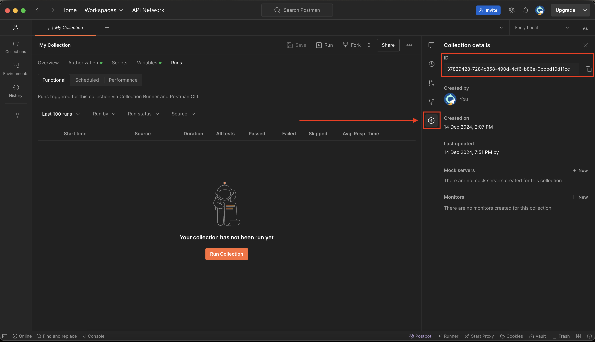

<div align="center">
  <h1>trpc-postman</h1>
  <a href="https://www.npmjs.com/package/trpc-postman"></a>
  <a href="./LICENSE"></a>
</div>

---

## Generate an Postman spec from your tRPC server, in one line of code

### Step 1: Install `trpc-postman`

```bash
# npm
npm install trpc-postman

# yarn
yarn install trpc-postman

# pnpm
pnpm install trpc-postman
```

### Step 2: Generate Postman Collection

```typescript
import { trpcToPostmanCollection } from "trpc-postman";

// generate Postman Collection JSON
const postmanCollection = trpcToPostmanCollection({
  collectionName: "My API",
  router: trpcRouter,
});
```

## Publishing the Postman Collection

You can update your Postman Collection using your Postman API key and Collection ID

### Step 1: Generate a Postman API key

You can generate a Postman API key [here](https://www.postman.com/settings/me/api-keys).

### Step 2: Get your Colllection ID

If you don't already have a collection to publish to, create a collection manually.

Then, you can see your Collection ID by clicking the `i` button on the right-hand side:



### Step 3: Publish collection

> WARNING!! This will ERASE your entire collection with the generated Postman Collection.

```typescript
import { trpcToPostmanCollection } from "trpc-postman";

// generate Postman Collection JSON
const postmanCollection = trpcToPostmanCollection({
  collectionName: "My API",
  router: trpcRouter,
});

// overwrite collection in postman
await updateRemotePostmanCollection({
  apiKey: POSTMAN_API_KEY,
  collectionId: YOUR_COLLECTION_ID,
  collection: postmanCollection,
});
```
